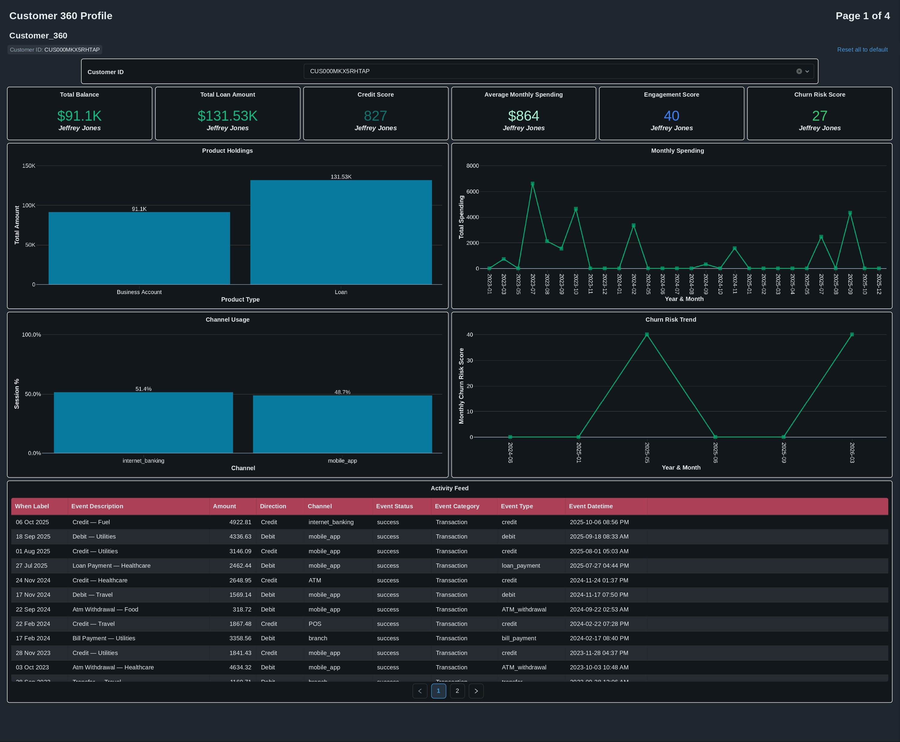
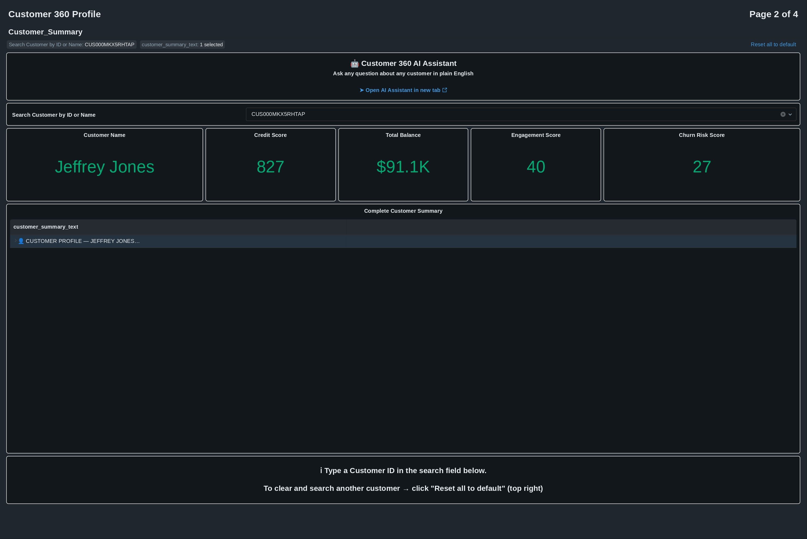
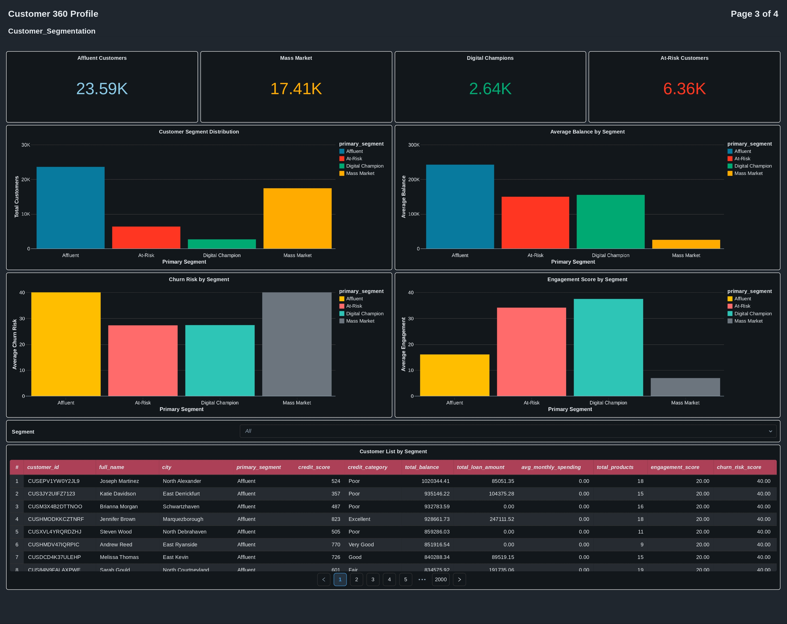
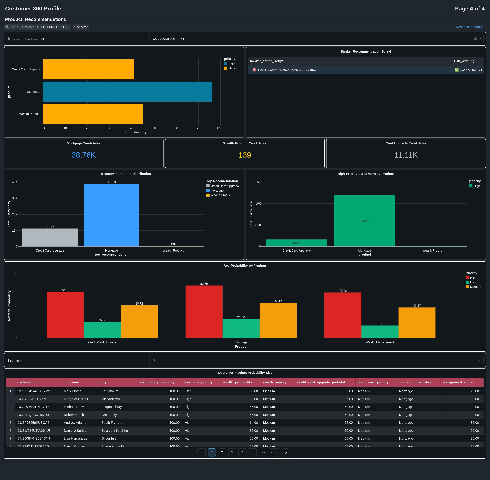

# Customer 360 — Enterprise Banking Data Platform
### Built on Databricks · Delta Lake · Unity Catalog · Medallion Architecture

<div align="center">


</div>

---

## What is Customer 360?

> *"A single, unified and complete view of a customer that combines all data about them across every system and channel in the bank."*

Without Customer 360, a bank sees the same customer in pieces:

| System | Sees the customer as |
|---|---|
| Core Banking | Account holder `ACC-123` |
| Cards System | Cardholder `CRD-456` |
| Loan System | Borrower `LOAN-789` |
| Mobile App | User session `USR-012` |
| CRM | Contact `CON-345` |

**With Customer 360:** All identities are resolved → one golden customer profile → complete picture.

---

## Dashboard Preview

### Page 1 — Customer 360 Profile (Individual View)


> Switch any Customer ID → every panel refreshes simultaneously showing that customer's complete profile

### Page 2 — Customer Summary (AI-Powered)


> Type any Customer ID → instant A-Z narrative summary with risk flags and banker action items + Genie AI assistant

### Page 3 — Customer Segmentation (Portfolio View)


> Portfolio-level view of all 50,000 customers segmented into Affluent, Mass Market, Digital Champions and At-Risk

### Page 4 — Product Recommendations (Action Board)


> Per-customer product probability scores with banker conversation scripts and recommended actions

---

## Architecture

```
┌─────────────────────────────────────────────────────────────────┐
│                    SOURCE DATA (11 CSV files)                    │
│  customers · accounts · cards · loans · branches · merchants   │
│  transactions · digital_activity · loan_payments               │
│  customer_interactions · notifications                         │
│                   1,170,500 total rows                         │
└──────────────────────────┬──────────────────────────────────────┘
                           │ read_files() + schema enforcement
                           │ + audit columns (ingestion_time, source_file)
                           ▼
┌─────────────────────────────────────────────────────────────────┐
│                    🟤 BRONZE LAYER                               │
│              Exact raw copy — no transformations                │
│                                                                 │
│  bronze_customers    bronze_accounts    bronze_cards            │
│  bronze_loans        bronze_branches    bronze_merchants        │
│  bronze_transactions bronze_digital_activity                   │
│  bronze_loan_payment bronze_customer_interactions              │
│  bronze_notifications                                          │
│                    11 Delta tables                             │
└──────────────────────────┬──────────────────────────────────────┘
                           │ Data quality rules · Type casting
                           │ ID reconciliation · Deduplication
                           │ Null handling · Derived columns
                           ▼
┌─────────────────────────────────────────────────────────────────┐
│                    🔵 SILVER LAYER                               │
│           Cleaned · Typed · Trusted · Entity-resolved           │
│                                                                 │
│  silver_customers      silver_accounts     silver_cards         │
│  silver_loans          silver_branches     silver_merchants     │
│  silver_transactions   silver_digital_activity                 │
│  silver_loan_payments  silver_customer_interactions            │
│  silver_notifications                                          │
│                   11 Silver tables                             │
│                                                                 │
│  ID Mapping Tables (6):                                        │
│  map_customer_ids  map_account_ids   map_card_ids              │
│  map_loan_ids      map_merchant_ids  map_branch_ids            │
└──────────────────────────┬──────────────────────────────────────┘
                           │ 8-way aggregation JOIN
                           │ Engagement score formula
                           │ Churn risk formula
                           │ Segmentation rules
                           │ Product recommendation engine
                           ▼
┌─────────────────────────────────────────────────────────────────┐
│                     🟡 GOLD LAYER                                │
│              Pre-aggregated · Business-ready · Dashboard-ready  │
│                                                                 │
│  customer_360          — 1 row per customer, all metrics       │
│  monthly_spending      — spend trend per customer per month    │
│  product_holdings      — balance per product type             │
│  channel_usage         — mobile vs desktop % per customer     │
│  churn_risk_monthly    — risk score trend over time           │
│  activity_feed         — merged transaction + interaction feed │
│  customer_segments     — 4-segment classification             │
│  customer_full_summary — AI-ready text narrative per customer  │
│  product_recommendations — cross-sell probability scores      │
│  bank_product_catalog  — product reference table             │
│                    10 Gold tables                              │
└──────────────────────────┬──────────────────────────────────────┘
                           │ Databricks AI/BI Dashboard
                           │ Field filter by customer_id
                           ▼
┌─────────────────────────────────────────────────────────────────┐
│                  📊 DATABRICKS DASHBOARD                         │
│              Customer 360 Profile — 4 pages                     │
│                                                                 │
│  Page 1: Customer_360        — Individual 360° profile          │
│  Page 2: Customer_Summary    — AI narrative + Genie assistant   │
│  Page 3: Customer_Segmentation — Portfolio segment analysis     │
│  Page 4: Product_Recommendations — Cross-sell action board      │
└─────────────────────────────────────────────────────────────────┘
```

---

## Project Stats

| Metric | Value |
|---|---|
| Source systems integrated | 11 |
| Total rows processed | 1,170,500 |
| Customer profiles built | 50,000 |
| Bronze tables | 11 |
| Silver tables | 11 |
| ID mapping tables | 6 |
| Gold tables | 10 |
| Dashboard pages | 4 |
| Dashboard widgets | 30+ |
| Lines of SQL | 2,000+ |

---

## Tech Stack

| Layer | Technology |
|---|---|
| Platform | Databricks (Unity Catalog, Community Edition) |
| Storage | Delta Lake (ACID transactions, time travel) |
| Catalog | Unity Catalog + Volumes |
| Language | SQL (primary) · PySpark (mapping + diagnostics) |
| Architecture | Medallion (Bronze → Silver → Gold) |
| Dashboard | Databricks AI/BI Dashboard |
| AI Assistant | Databricks Genie Space |
| Source control | GitHub |

---

## Key Features

### 🔐 Entity Resolution
11 source systems had mismatched ID formats (e.g. `CUST5041` vs `CUSXAJI0Y6DPBHS`). Six SQL mapping tables reconcile all synthetic IDs to real customer IDs — so every join across the entire platform works correctly.

### 📊 Computed Intelligence Scores

**Engagement Score (0–100)**
```
Login frequency      × 30%   (how often the customer logs in)
Transaction activity × 30%   (how many transactions they make)
Products held        × 20%   (how many products they use)
Mobile usage         × 20%   (what % of sessions are mobile)
```

**Churn Risk Score (0–100 — higher = more at risk)**
```
Missed payment %           × 40%   (strongest signal)
Days since last transaction × 30%   (recency of engagement)
Complaint count            × 20%   (service dissatisfaction)
Notification disengagement × 10%   (ignoring bank communications)
```

### 🎯 Customer Segmentation (4 segments)

| Segment | Rule | Customers | % |
|---|---|---|---|
| Affluent | `total_balance > $100K` | 23,591 | 47.2% |
| Mass Market | All others | 17,409 | 34.8% |
| Digital Champion | `mobile_pct > 50% AND sessions > 20` | 2,640 | 5.3% |
| At-Risk | `missed_payment_pct > 10% OR days_inactive > 90` | 6,360 | 12.7% |

### 💡 Product Recommendation Engine (3 products)

| Product | Key signals | Customers recommended |
|---|---|---|
| Mortgage | Credit score + balance + no existing loan | 38,756 (77.5%) |
| Wealth Product | High balance + engagement + spending | 139 (0.3%) |
| Credit Card Upgrade | Has card + mobile usage + spending | 11,105 (22.2%) |

Each recommendation includes a **banker conversation script** — the exact words to say to the customer — and a **risk warning** indicating whether to lead with retention or cross-sell.

### 🤖 AI-Powered Customer Summary (Page 2)
Every customer has a machine-generated A-Z narrative covering identity, financial position, engagement behaviour, payment health, service interactions, risk flags and recommended banker actions. A non-technical relationship manager types one customer ID and gets a complete briefing in seconds.

---

## Data Quality Rules

Every Silver table enforces three levels of quality rules:

| Rule type | Action | Example |
|---|---|---|
| Primary key null | **DROP** — row removed | `account_id IS NOT NULL` |
| Foreign key null | **DROP** — orphan row useless | `customer_id IS NOT NULL` |
| Business rule violation | **DROP** — invalid data | `balance_usd >= 0` |
| Unknown enum value | **FLAG** — row kept, column set | `account_type NOT IN valid set` |
| Rescued data present | **FLAG** — schema mismatch | `_rescued_data IS NOT NULL` |

---

## ID Reconciliation — The Critical Challenge

The 5 synthetic datasets used short sequential IDs (`CUST5041`, `LOAN68771`) while the original 6 datasets used 15-character alphanumeric IDs (`CUSXAJI0Y6DPBHS`). This caused 0% referential integrity — no joins worked.

**Solution — 6 SQL mapping tables built in Silver layer:**

```sql
-- Pattern used for all 6 mapping tables
CREATE OR REPLACE TABLE customer_360.silver.map_customer_ids AS
WITH
synth_numbered AS (
  SELECT customer_id AS synth_id,
         ROW_NUMBER() OVER (ORDER BY customer_id) AS rn
  FROM   all_synthetic_tables_unioned
),
real_numbered AS (
  SELECT customer_id AS real_id,
         ROW_NUMBER() OVER (ORDER BY RAND(42)) AS rn,
         COUNT(*) OVER () AS total_real
  FROM   customer_360.bronze.bronze_customers
)
SELECT s.synth_id, r.real_id
FROM   synth_numbered s
JOIN   real_numbered  r
  ON   r.rn = MOD(s.rn - 1, r.total_real) + 1;
```

After mapping: every transaction, digital activity record, loan payment, interaction and notification traces back to exactly one real customer. 100% referential integrity across all 11 datasets.

---

## Dashboard Pages

### Page 1 — Customer_360 (Individual Profile)
**Purpose:** Relationship managers use this before customer meetings.

**Panels:**
- Customer ID filter — switches all 12 widgets simultaneously
- 6 KPI cards: Total Balance, Loan Exposure, Credit Score, Monthly Spend, Engagement Score, Churn Risk Score
- Product Holdings — horizontal bar chart (Savings, Checking, Business, Loan)
- Monthly Spending — line chart (2023–2025)
- Channel Usage — bar chart (internet_banking vs mobile_app %)
- Churn Risk Trend — monthly risk score over time
- Activity Feed — merged transaction + interaction timeline

---

### Page 2 — Customer_Summary (AI-Powered Briefing)
**Purpose:** Non-technical bankers get a complete customer briefing from one search.

**Panels:**
- 🤖 Genie AI Assistant link (opens in new tab)
- Customer ID search field
- 5 KPI counters: Name, Credit Score, Total Balance, Engagement Score, Churn Risk Score
- Complete Customer Summary — full A-Z narrative text including:
  - Identity and tenure
  - Financial position (balance, loans, cards)
  - Engagement behaviour
  - Payment health status
  - Service interaction history
  - 🚨 Risk flags (auto-generated)
  - 🎯 3 recommended banker actions (personalised per customer)

---

### Page 3 — Customer_Segmentation (Portfolio View)
**Purpose:** Marketing and risk teams see the entire customer base grouped by behaviour.

**Panels:**
- 4 KPI counters: Affluent (23.59K), Mass Market (17.41K), Digital Champions (2.64K), At-Risk (6.36K)
- Customer Segment Distribution — bar chart
- Average Balance by Segment — bar chart
- Churn Risk by Segment — bar chart
- Engagement Score by Segment — bar chart
- Customer List by Segment — filterable table (50,000 rows)
- Segment filter — click any segment to drill down

---

### Page 4 — Product_Recommendations (Action Board)
**Purpose:** Sales teams identify which customers to call and what to offer them.

**Panels:**
- Customer ID search filter
- Per-customer probability bars (Mortgage / Wealth / Card Upgrade)
- Banker Recommendation Script — exact conversation script per customer
- Risk Warning — HIGH/MEDIUM/LOW churn flag before cross-selling
- 3 KPI counters: Mortgage Candidates (38.76K), Wealth Candidates (139), Card Upgrade (11.11K)
- Top Recommendation Distribution — bar chart
- High Priority Customers by Product — bar chart
- Avg Probability by Product × Priority — grouped bar chart
- Customer Product Probability List — full filterable table

---

## Repository Structure

```
customer-360-databricks/
│
├── 00_Project_Architecture.py   # Visual pipeline diagram + live row counts
├── Bronze.py                    # Raw ingestion from 11 CSVs to Delta tables
├── Silver.py                    # Data quality + ID reconciliation + cleaning
├── Gold.py                      # Business aggregations + score formulas
│
├── dashboard_preview_page1.png  # Customer_360 dashboard screenshot
├── dashboard_preview_page2.png  # Customer_Summary dashboard screenshot
├── dashboard_preview_page3.png  # Customer_Segmentation dashboard screenshot
├── dashboard_preview_page4.png  # Product_Recommendations dashboard screenshot
│
└── README.md                    # This file
```

---

## How to Run

### Prerequisites
- Databricks account (Community Edition or higher)
- Unity Catalog enabled
- Catalog named `customer_360` with schemas `bronze`, `silver`, `gold`

### Step 1 — Upload source files
Upload all 11 CSV files to:
```
/Volumes/customer_360/source_data/raw/
```

Organize into subfolders matching the Bronze notebook paths:
```
/Accounts/       /Branches/      /Cards/
/Customers/      /Loans/         /Merchants/
/Transactions/   /Digital_Activity/
/Loan_Payment/   /Customer_Transactions/
/Notifications/
```

### Step 2 — Run notebooks in order
```
1. Bronze.py              → creates 11 bronze Delta tables
2. Silver.py              → creates 6 mapping tables + 11 silver tables
3. Gold.py                → creates 10 gold tables
4. 00_Project_Architecture.py → verify all layers with live row counts
```

### Step 3 — Build the dashboard
In Databricks → Dashboards → Create dashboard → `Customer 360 Profile`

Add 4 pages and 10 datasets following the Gold layer SQL queries. Connect the customer_id field filter to all datasets on each page.

### Step 4 — Set up Genie AI Assistant
Databricks → Genie Spaces → New Genie Space → include all 4 Gold tables → link from Customer_Summary page.

---

## Skills Demonstrated

```
Data Engineering
├── Medallion Architecture (Bronze → Silver → Gold)
├── Delta Lake (ACID, schema enforcement, time travel)
├── Unity Catalog (catalog, schema, volumes, governance)
├── Entity Resolution (ID reconciliation across 11 systems)
├── Data Quality (quality rules, null handling, deduplication)
├── SQL (window functions, CTEs, UNION, complex aggregations)
├── PySpark (broadcast variables, UDFs, DataFrame API)
└── Data Modelling (star schema, aggregation tables, derived metrics)

Analytics Engineering
├── KPI design (engagement score, churn risk score)
├── Customer segmentation (business rule-based, 4 segments)
├── Product recommendation engine (weighted probability formulas)
├── Text generation (SQL-generated customer narrative)
└── Dashboard design (Databricks AI/BI, 4 pages, 30+ widgets)

Soft Skills
├── Business domain knowledge (retail banking, Customer 360)
├── Non-technical communication (banker-friendly summaries)
└── Enterprise thinking (governance, lineage, audit columns)
```

---

## Author

**Raihan Kabir**
Data Engineering · Machine Learning

[](mailto:raihank0192@gmail.com)
[](https://www.linkedin.com/in/raihan-kabir218)
[](https://github.com/RaihanKabir277)

---

## Certifications

- 🏆 **Databricks Accredited Data Engineer Associate** — Databricks Academy (April 2026)
- 🏆 **Cloudera Technical Expert Accreditation** — Cloudera Partner Network (Feb 2026 – Feb 2028)

---

<div align="center">

*Built with SQL, PySpark, Delta Lake and Databricks*
*Medallion Architecture · Unity Catalog · AI/BI Dashboard · Genie AI*

</div>

